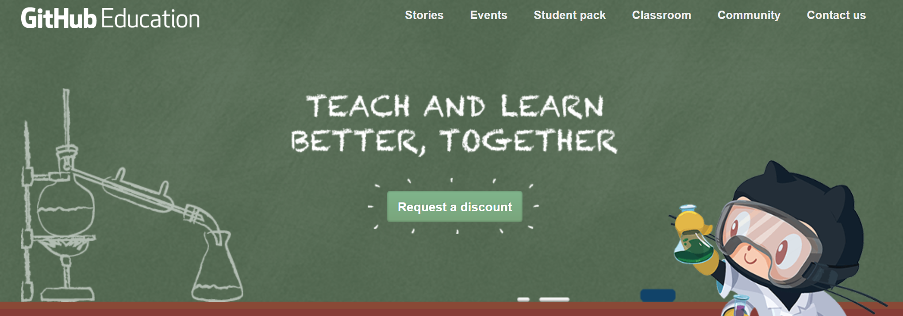
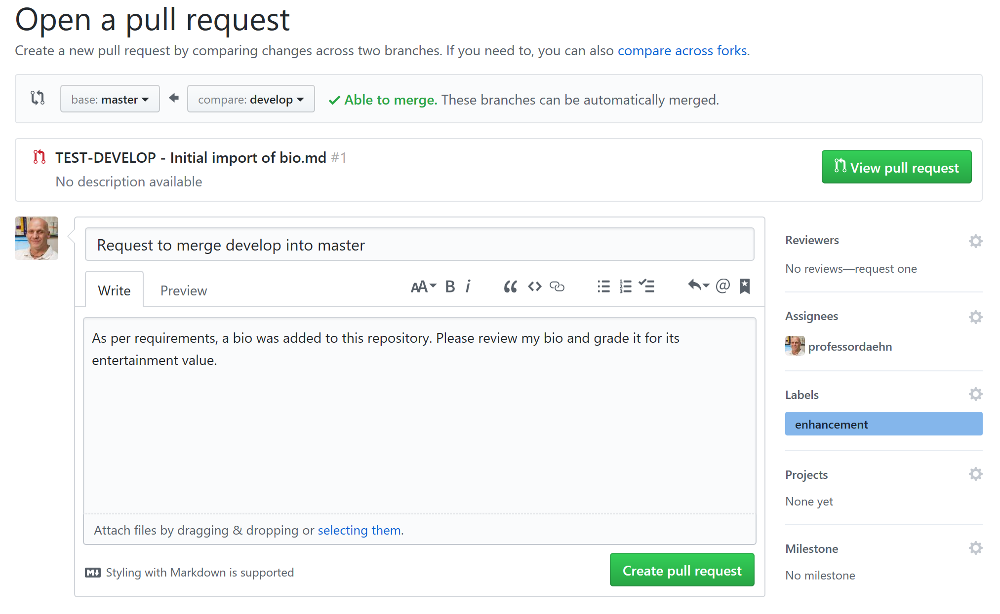

## Lab 0: Introduction to Version Control and GitHub

This lab introduces the student to a common distributed version control system (`git`) and a central repository for hosting our work (GitHub). This "zeroth" lab is an ungraded lab and simply gets students set up for future work in the course.

## Objectives

By the end of this lab, students should have

* a basic understanding of distributed version control systems
* created a GitHub account for free with unlimited private repositories
* joined the CSC131 organization on GitHub
* signed into Slack and introduced themselves to the class

## Version Control Systems

### The basics of `git`

Check out the following GitHub Guide:

* [https://guides.github.com/introduction/git-handbook/](https://guides.github.com/introduction/git-handbook/) - about a 10 minute read

### GitHub

For a quick glimpse at how we (software developers) typically use GitHub to develop software, check out [https://youtu.be/w3jLJU7DT5E](https://youtu.be/w3jLJU7DT5E) - a 3-4 minute video.

Check out the following GitHub Guides:

* [https://guides.github.com/activities/hello-world/](https://guides.github.com/activities/hello-world/) - about a 10 minute read
* [https://guides.github.com/introduction/flow/](https://guides.github.com/introduction/flow/) - about a 5 minute read
* 

Creating your account: [https://education.github.com/](https://education.github.com/)

#### Markdown

As a side topic, learn a bit about Markdown, a way to style text in GitHub:

* [https://guides.github.com/features/mastering-markdown/](https://guides.github.com/features/mastering-markdown/) - about a 3 minute read

## Tasks

Before embarking upon these tasks, you *must* have a GitHub account. If you haven't done so already, log into GitHub.

1. Accept the assignment link sent to you by your instructor. When this link is loaded into a browser, it will kick off a process wherein a new repository will be created in your GitHub account (named lab00). From a Git bash shell, _clone_ this repository to your local machine using the following command: `git clone https://github.com/msu-csc131/lab00-YourGitHubUserName.git` where `YourGitHubUserName` is your actual GitHub user name. You'll most likely be prompted to login to GitHub -- do so using your GitHub credentials. If you've set up Two-Factor Authentication (something I recommend doing), you'll have to enter those credentials as well. Note: If you have set up an SSH key on GitHub (something I recommend doing), then the repository's URL in the command is a bit different: `git clone git@github.com:msu-csc131/lab00-YourGitHubUserName.git`, again where `YourGitHubUserName` is your actual GitHub user name.
1. The above step will create a new directory with the name `lab00-YourGitHubUserName`. Navigate into that directory with the command: `cd lab00-YourGitHubUserName` (followed by hitting ENTER or Return to execute the shell command). From here on, I'll refer to this directory as your "working" directory.
1. Create (and checkout) a new branch within to do your work with the following command: `git checkout -b develop`
1. Verify that you're in the `develop` branch using the command: `git branch` by noting that two branches are listed (master and develop) and that there is an * next to the `develop` branch.
1. Create a new file in your working directory named `bio.md` and write a brief bio in this file using the Markdown language. It doeesn't have to be accurate (or real), but it is _should_ be entertaining; your instructor likes to be entertained!
1. When you have finished your bio, save your changes and stage your changes with the following command: `git add bio.md`
1. Next, commit your changes with the following command: `git commit -m"LAB00-DEVELOP - Initial import of bio.md`
1. Now push your changes to GitHub with the following command: `git push --set-upstream origin develop` NOTE: the `--set-upstream origin develop` is required only the first time you push your changes to GitHub. Any subsequent commits can be pushed simply using the `git push` command.
1. The previous steps have created a new branch that has differences from the original, `master` branch. Once you have made all the changes necessary for an assignment (and at this point, you have for lab 0), it comes time to create a _pull request_. When you create pull request, you're request that others verify the changes you'd like to _pull into_ the `master` branch from some other branch (in this case, from the `develop` branch). Visit your repo on GitHub and find a button labeled "Compare & pull request". Clicking this button will create a new pull request. Take this action and fill in the details accordingly. There should be an arrow pointing _from_ the `develop` branch _to_ the `master` branch. Feel free to change the title of the pull request (which by default, tends to use the last commit message) and leave a comment if you wish. Be sure to add your instructor (professordaehn) as a reviewer, and assign yourself as the assignee. Add a label to the pull request ("enhancement"). With all these fields set, click on the "Create pull request" button. See the figure below:

Note: This figure is from another repo I created named "test" some some fields/text may not look correct. Also, I can't add myself as a reviewer, so the Reviewer field is also left blank. When you add me as a reviewer make sure it is "professordaehn" -- I have a few GitHub accounts so don't look for me by name -- specify me as "professordaehn".

